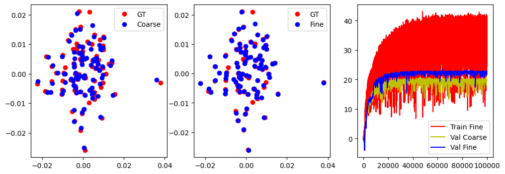

# NeWRF
NeWRF: A Deep Learning Framework for Wireless Radiation Field Reconstruction and Channel Prediction 
[[Paper]](https://arxiv.org/abs/2403.03241) 

## Requirement
- Python: 3.10.9
- Pytorch: 1.13.1
- CUDA: 11.7

## Usage
- simulator/ contains the simulation code. Run main.m in MATLAB to generate datasets
- train.py contains the training code. Usage:
```
python train.py --env [environment]
```
- eval.py contains the evaluation code. Usage:
```
python eval.py --env [environment] --ckpt [checkpoint file] 
```
- demo.ipynb provides visualization during the training process 

